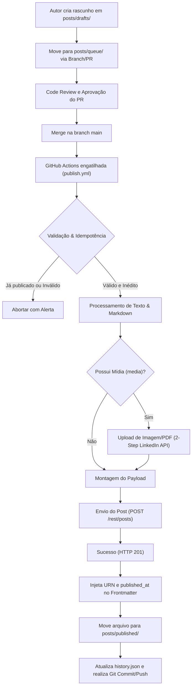
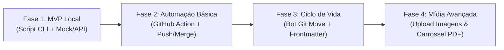

# PRD — LinkedIn Content as Code (GitOps Pipeline)

> **Versão:** V0.1  
> **Data:** 2026-09-10  
> **Autor:** Antigravity AI / Guima  
> **Status:** Aprovado para Desenvolvimento (Core)  
> **Repositório:** `git-linkedin-posts`

---

## 1. Registro de Revisão

| Versão | Data | Responsável | Descrição da Alteração |
|---|---|---|---|
| V0.1 | 2026-09-10 | Antigravity AI / Guima | Versão inicial consolidada com base no documento de especificação técnica e arquitetura GitOps. |

---

## 2. Contexto da Demanda

A produção e publicação de conteúdo técnico em redes sociais (especificamente o LinkedIn) frequentemente sofrem com a dependência de interfaces web proprietárias, que não oferecem:
- Suporte a versionamento histórico com Git.
- Fluxo de trabalho colaborativo baseado em Pull Requests e code review.
- Autonomia para compor posts localmente em Markdown com editores modernos (VS Code, Obsidian, etc.).
- Rastreabilidade precisa do ciclo de vida das publicações (da concepção ao post publicado).

A iniciativa **LinkedIn Content as Code** visa tratar publicações técnicas como artefatos de código, permitindo que desenvolvedores e times de engenharia criem, revisem, aprovem e publiquem posts de forma 100% automatizada e idempotente através de um pipeline GitOps no GitHub Actions.

---

## 3. Visão Geral do Projeto

| Item | Descrição |
|---|---|
| **Plataformas Envolvidas** | GitHub (Git / Repositório / GitHub Actions) e LinkedIn REST API |
| **Público-Alvo** | Desenvolvedores, Engenheiros de Software, Tech Leads e DevRels |
| **Linguagem / Runtime** | Python 3.11+ (ou Node.js LTS) para script de publicação |
| **Integração Externa** | LinkedIn Posts API (`POST /rest/posts` com versão `202401`) e Images API |
| **Interface do Usuário** | Repositório Git (arquivos Markdown, YAML Frontmatter e PRs do GitHub) |
| **Funcionalidade Principal** | Disparo automatizado de publicação no LinkedIn no merge da branch `main`, com movimentação de arquivos e enriquecimento de metadados. |

---

## 4. Requisitos do Produto

### 4.0 Fluxo do Usuário e Pipeline GitOps

O ciclo de vida do post segue uma esteira editorial estrita através da estrutura de pastas do repositório:



#### Tabela de Transição de Estados do Post:

| Estado | Diretório | Ação Humana | Ação da Automação | Gatilho de Mudança |
|---|---|---|---|---|
| **Rascunho** | `posts/drafts/` | Escrita e brainstorming livre | Nenhuma | Autor decide avançar |
| **Na Fila** | `posts/queue/` | Abertura e aprovação de PR | Validação de syntax (CI opcional) | Merge do PR na branch `main` |
| **Publicado** | `posts/published/` | Leitura / Consulta histórica | Commit do bot com URN e timestamp | Resposta HTTP 201 da LinkedIn API |

---

### 4.1 Interface de Autoria e Especificação GitOps

Não há frontend web dedicado; a interface do usuário é o repositório Git e a CLI do desenvolvedor.

#### 4.1.1 Especificação da Estrutura de Diretórios

O repositório deve seguir rigidamente a seguinte hierarquia:

```text
git-linkedin-posts/
├── .github/
│   └── workflows/
│       └── publish.yml             # Workflow de automação do GitHub Actions
├── posts/
│   ├── drafts/                     # Rascunhos e ideias em desenvolvimento
│   │   └── 2026-09-exemplo.md
│   ├── queue/                      # Posts revisados e prontos para publicação
│   │   └── 2026-09-15-query-opt.md
│   └── published/                  # Posts que já foram publicados no LinkedIn
│       └── 2026-09-01-boas-vindas.md
├── assets/                         # Imagens, diagramas e documentos (PDF)
│   └── 2026-09-15/
│       └── diagram.png
├── scripts/
│   ├── publisher.py                # Script de parsing, formatação e chamada de API
│   └── requirements.txt            # Dependências do script (ex: pyyaml, requests)
├── history.json                    # Log histórico de IDs, hashes e timestamps publicados
└── README.md                       # Documentação de uso e guia de contribuição
```

#### 4.1.2 Critérios de Aceitação da Interface GitOps
- [ ] Qualquer arquivo adicionado à pasta `posts/queue/` deve ser um arquivo Markdown válido contendo YAML Frontmatter delimitado por `---`.
- [ ] O autor deve poder rodar o script localmente em modo `--dry-run` para visualizar a formatação final do texto antes de comitar.
- [ ] Ao mesclar na `main`, a ação deve processar apenas os arquivos pendentes localizados em `posts/queue/`.

---

### 4.2 Lógica de Negócio e Transformação de Dados

Como a API do LinkedIn não suporta formatação Markdown tradicional nativa (ex: `**negrito**` ou `- item`), o componente `publisher.py` deve realizar transformações determinísticas antes do envio:

1. **Validação Prévia:**
   - **Tamanho Máximo:** O texto processado não pode ultrapassar 3.000 caracteres (limite oficial da API do LinkedIn para `commentary`).
   - **Existência de Mídia:** Se o atributo `media` estiver preenchido, o script deve validar a existência física do arquivo indicado no diretório relativo antes de prosseguir.

2. **Transformação de Texto:**
   - **Listas Não Ordenadas:** Substituição automática de marcadores de lista (`- item` ou `* item`) pelo caractere Unicode bullet (`• item`).
   - **Tratamento de Tags:** Conversão da lista de `tags` do Frontmatter em hashtags anexadas ao final da publicação (exemplo: `tags: [backend, java]` vira `#backend #java` no rodapé).
   - **Espaçamento e Legibilidade:** Preservação de quebras de linha duplas entre parágrafos para correta renderização no feed mobile e desktop do LinkedIn.
   - **Links Canônicos:** Caso o campo `canonical_url` esteja presente, seu link deve ser adicionado ao final do texto ou vinculado como link preview.

3. **Mecanismo de Idempotência e Prevenção de Duplicatas:**
   - **Checagem de URN:** Se o arquivo Markdown já contiver o metadado `linkedin_post_urn` populado, o script ignora o arquivo e emite um aviso no log do job.
   - **Registro em `history.json`:** Cada publicação bem-sucedida deve registrar um objeto contendo:
     - `file_path`: Caminho original e final do arquivo.
     - `title`: Título do post.
     - `content_hash`: Hash SHA-256 do conteúdo para evitar reenvio mesmo se renomeado.
     - `urn`: URN retornado pelo LinkedIn.
     - `published_at`: Timestamp ISO-8601 da publicação.
   - **Movimentação de Arquivo:** O arquivo processado deve ser movido atomicamente de `posts/queue/<arquivo>.md` para `posts/published/<arquivo>.md`.

---

### 4.3 Gestão de Conteúdo e Formato de Post

Cada publicação é representada por um arquivo Markdown individual contendo Frontmatter YAML e o corpo textual.

#### 4.3.1 Schema de Metadados (YAML Frontmatter)

| Campo | Tipo | Obrigatório | Descrição |
|---|---|---|---|
| `title` | string | Sim | Título de referência interna (usado em logs e identificação). |
| `tags` | list[string] | Não | Tags que serão convertidas automaticamente em hashtags `#tag`. |
| `media` | string | Não | Caminho relativo para imagem (`.png`, `.jpg`) ou PDF carrossel. |
| `canonical_url` | string | Não | Link de artigo externo, repositório ou página de referência. |
| `visibility` | string | Não | Visibilidade do post: `PUBLIC` (padrão) ou `CONNECTIONS`. |
| `published_at` | string (ISO-8601) | Gerado | Preenchido automaticamente pela automação após a publicação. |
| `linkedin_post_urn` | string | Gerado | URN retornado pela API do LinkedIn (ex: `urn:li:share:...` ou `urn:li:rest:...`). |

#### 4.3.2 Exemplo de Arquivo de Fila (`posts/queue/2026-09-15-query-opt.md`)

```markdown
---
title: "Otimização de Consultas SQL e Hibernate"
tags:
  - backend
  - java
  - performance
  - databases
media: "assets/2026-09-15/diagram.png"
canonical_url: "https://github.com/usuario/meu-projeto"
visibility: "PUBLIC"
---

Você já mediu o impacto de um N+1 em produção? 🔍

Em sistemas multi-tenant com alto volume de escrita e leitura, uma consulta mal planejada pode sobrecarregar o pool de conexões do banco em segundos.

Aqui estão 3 práticas fundamentais que aplico para mitigar esse gargalo:
- Uso criterioso de Fetch Joins e EntityGraphs.
- Paginação baseada em chaves (keyset pagination) para grandes tabelas.
- Monitoramento contínuo de slow queries via logs estruturados.

No repositório do link abaixo deixei um exemplo prático demonstrando o ganho de throughput após o refactor.
```

---

### 4.4 Requisitos de Integração e Backend (API do LinkedIn)

#### 4.4.1 Resumo de Negócio (Camada de Produto)
O sistema deve interagir de forma não-interativa com a API REST oficial do LinkedIn, atuando como um cliente autenticado em nome do usuário (`author_urn`). Deve ser capaz de criar publicações em texto puro e com anexos de imagem ou carrossel de páginas (PDF).

#### 4.4.2 Detalhes Técnicos de Integração (Camada de Engenharia)

##### Cabeçalhos Padrão de Requisição:
- `Authorization`: `Bearer ${LINKEDIN_ACCESS_TOKEN}`
- `LinkedIn-Version`: `202401`
- `X-Restli-Protocol-Version`: `2.0.0`
- `Content-Type`: `application/json`

##### Fluxo de Upload de Mídia em 2 Etapas (Quando `media` estiver presente):
1. **Passo 1: Inicialização do Upload de Imagem**
   - **Método & Endpoint:** `POST https://api.linkedin.com/rest/images?action=initializeUpload`
   - **Payload de Requisição:**
     ```json
     {
       "initializeUploadRequest": {
         "owner": "urn:li:person:YOUR_PERSON_URN"
       }
     }
     ```
   - **Resposta Esperada (HTTP 200):** Obtenção do `uploadUrl` e do `image` (URN no formato `urn:li:image:...`).
2. **Passo 2: Upload Binário do Arquivo**
   - **Método & Endpoint:** `PUT <uploadUrl>` (URL pré-assinada retornada no passo 1).
   - **Headers:** `Content-Type: image/png` (ou `image/jpeg`).
   - **Body:** Binário do arquivo local referenciado em `media`.
   - **Resposta Esperada:** HTTP 200/201.

##### Envio da Publicação (Criação de Post):
- **Método & Endpoint:** `POST https://api.linkedin.com/rest/posts`
- **Payload de Post de Texto Simples:**
  ```json
  {
    "author": "urn:li:person:YOUR_PERSON_URN",
    "commentary": "Conteúdo transformado do post com • bullets e #hashtags...",
    "visibility": "PUBLIC",
    "distribution": {
      "feedDistribution": "MAIN_FEED",
      "targetEntities": [],
      "thirdPartyDistributionChannels": []
    },
    "lifecycleState": "PUBLISHED",
    "isReshareDisabledByAuthor": false
  }
  ```
- **Payload com Mídia Anexada (Imagem):**
  ```json
  {
    "author": "urn:li:person:YOUR_PERSON_URN",
    "commentary": "Conteúdo transformado...",
    "visibility": "PUBLIC",
    "distribution": { "feedDistribution": "MAIN_FEED" },
    "content": {
      "media": {
        "title": "Otimização de Consultas SQL",
        "id": "urn:li:image:RETORNADO_NO_PASSO_1"
      }
    },
    "lifecycleState": "PUBLISHED",
    "isReshareDisabledByAuthor": false
  }
  ```
- **Resposta da API:**
  - Código: `HTTP 201 Created`
  - Header retornado: `x-restli-id` (ou `x-linkedin-id`) contendo o URN do post criado.

---

## 5. Requisitos de Dados e Observabilidade

### 5.1 Rastreabilidade e Log Histórico (`history.json`)
O arquivo `history.json` funciona como a fonte da verdade sobre o histórico de publicações efetuadas pelo repositório.

**Schema do `history.json`:**
```json
[
  {
    "file_path": "posts/published/2026-09-15-query-opt.md",
    "title": "Otimização de Consultas SQL e Hibernate",
    "content_hash": "a5d89f4b67...",
    "linkedin_urn": "urn:li:share:7123456789012345678",
    "published_at": "2026-09-15T14:30:00Z",
    "media_attached": true
  }
]
```

### 5.2 Métricas de Sucesso do Produto

> ⚠️ **TBD — Métricas de negócio e engajamento:** A definição de KPIs como taxa de engajamento, impressões e cliques foi postergada pelo solicitante para focar estritamente na entrega do **core operacional e técnico** do projeto.

#### Métricas Técnicas e Operacionais do Core:
| Métrica | Meta | Método de Medição |
|---|---|---|
| **Taxa de Sucesso de Publicação** | 100% de posts válidos na fila publicados com sucesso | Logs de execução da GitHub Action |
| **Taxa de Duplicidade** | 0% (zero envios duplicados em re-execuções) | Verificação de duplicatas no `history.json` |
| **Tempo de Execução do Pipeline** | < 60 segundos por post | Duração do job no GitHub Actions |

---

## 6. Requisitos Não Funcionais

### 6.1 Performance
- O script Python deve processar o parsing de frontmatter e validação em menos de 2 segundos.
- O tempo total de upload de mídia binária e requisição à API do LinkedIn não deve exceder 30 segundos sob conexões normais.

### 6.2 Tolerância a Falhas e Idempotência
- **Atomicidade:** Caso a chamada à API do LinkedIn falhe (HTTP 4xx/5xx), o script deve encerrar com exit code diferente de zero, **sem** mover o arquivo para `posts/published/` e **sem** comitar alterações no Git.
- **Transparência de Erro:** As mensagens de erro retornadas pela API do LinkedIn devem ser extraídas e exibidas de forma clara no console da GitHub Action.
- **Rollback / Retry Seguro:** Como o arquivo permanece em `posts/queue/` em caso de erro, a correção de credenciais ou rede permite a reexecução do workflow sem efeitos colaterais.

### 6.3 Segurança e Gerenciamento de Credenciais

1. **GitHub Secrets:**
   - `LINKEDIN_ACCESS_TOKEN`: Token de autorização OAuth 2.0.
   - `LINKEDIN_AUTHOR_URN`: Identificador único do autor (`urn:li:person:...` ou `urn:li:organization:...`).
2. **Mitigação da Expiração do Token (60 dias):**
   - **Estratégia Fase 1 a 3 (Simplificada):** Rotação manual assistida. Configurar notificação ou agendamento para renovar o segredo a cada 50 dias.
   - **Estratégia Fase 4 (Webhook Intermediário Automático):** O pipeline pode delegar a requisição ou o refresh para um serviço seguro próprio (ex: n8n ou Cloudflare Worker / AWS Lambda) que armazene o `Client Secret` e execute o fluxo de Refresh Token OAuth de forma autônoma.

---

## 7. Estratégia de Implementação e Roadmap

A implementação é dividida em 4 fases sequenciais para garantir entrega contínua de valor e testes incrementais:



| Fase | Escopo | Entregáveis Principais | Critério de Aceite |
|---|---|---|---|
| **Fase 1: MVP Local** | Script Python executável localmente via CLI | `scripts/publisher.py`, `requirements.txt`, parsing de Markdown e envio de texto puro. | Script lê um arquivo `.md` fixo local e posta texto + hashtags no LinkedIn via terminal. |
| **Fase 2: Automação Básica** | Pipeline de CI/CD via GitHub Actions | `.github/workflows/publish.yml`, configuração de GitHub Secrets. | Merge na branch `main` executa a Action e aciona o script automaticamente. |
| **Fase 3: Ciclo de Vida Automático** | Bot GitOps e Idempotência completa | Lógica de movimentação `queue/` -> `published/`, injeção de URN/data, atualização do `history.json` e auto-commit. | Post publicado é automaticamente arquivado e comitado pelo bot no repositório. |
| **Fase 4: Mídia e Artigos** | Suporte a anexos visuais | Upload em 2 etapas para imagens (`.png`, `.jpg`) e documentos carrossel em `.pdf`. | Post com campo `media` faz upload do arquivo e o anexa corretamente à postagem. |
